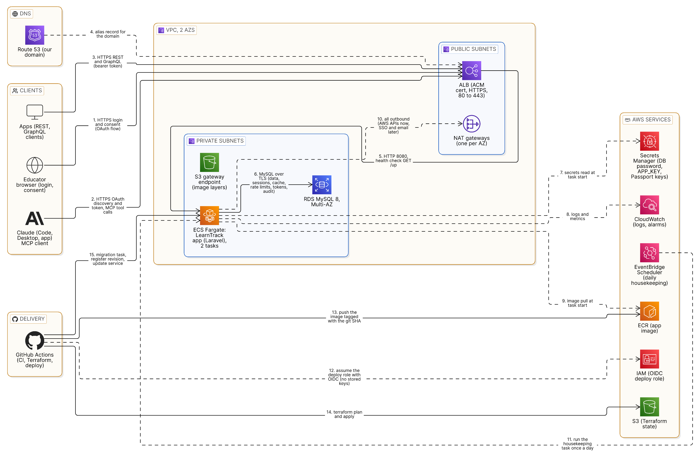

# PAS-001: LearnTrack

**Blueprint: LearnTrack** PAS-001 | Status: Approved | Owner: Gilbert | Updated: 09/10/2026

## What problem we're solving and why

Medical educators teach groups of learners, for example a cohort of third-year students or residents on a rotation. They assign articles and question sets from a content library, and expect learners to finish them by a due date.

An educator may run several groups, each with dozens of learners and many assignments. To find who needs help, they open each group and scan long progress tables.

LearnTrack lets the educator ask about progress in plain language through an AI assistant such as Claude, get a clear answer with reasons, and act on it in the same conversation. For example:

1. "Which learners in Cardiology Group A are behind?"
2. Claude answers: Sara has the ECG quiz overdue since Monday, and Tom's average question set score is 42.
3. "Assign ECG basics to those two, due Friday."
4. The educator approves, and the content is assigned.

So the flow will be:

- The educator creates a group, adds learners and assigns content with due dates
- Learners see their assignments and mark their progress
- The educator connects Claude to LearnTrack once, with their own login
- The educator asks about progress and gets answers with reasons
- The educator acts through Claude (assign content, move a due date), approving each change

**Current State:** What happens today without this solution?

- Slow manual review: the educator opens every group and scans progress tables to find who needs help, and repeats this for every group, every week.
- Late help: struggling learners are noticed too late, often after several due dates have passed.

**Impact:**

- Faster review: one question replaces scanning many progress tables
- Earlier help: the behind rule finds learners with an overdue assignment or low scores, with the reason, so the educator can act the same day
- Safe AI access: the AI only sees groups the educator teaches, gets only names and progress (no emails), can never delete data, and every change it makes is logged
- Same answer everywhere: REST, GraphQL and MCP share one authorization rule and one behind rule, so every interface gives the same answer

**Context**

LearnTrack is a backend service for medical schools and teaching hospitals. It has two ways in: a REST and GraphQL API for apps, and an MCP server that AI clients such as Claude connect to. There is no product frontend in v1. The only web pages are the OAuth login, consent and error screens, built with Inertia and React so later screens use the same stack.

Data is organized into a hierarchy:

- Institution
  - Group (taught by one or more educators)
    - Learner
- Content library: articles and question sets, each with a topic
- Assignment: a content item given to a group, or to some learners in it, with a due date

An educator only sees and acts on the groups they teach. A learner only sees their own assignments and progress.

### Key Terminologies

| Term | Definition |
|---|---|
| Institution | A medical school or teaching hospital |
| Group | A cohort of learners taught by one or more educators |
| Educator | A user who creates groups, assigns content and tracks progress |
| Learner | A user who works through assignments and marks progress |
| Content item | An article or a question set, with a title, topic, type and estimated minutes |
| Assignment | A content item given to a group, or to some learners in it, with a due date |
| Status | Not started, in progress, completed or overdue. Overdue means the due date has passed and the assignment is not completed |
| Behind | A learner with at least one overdue assignment in a group, or an average question set score below 50 in that group |
| MCP | Model Context Protocol: the standard way AI clients such as Claude call tools on another system |
| MCP tool | One action Claude can call on LearnTrack, for example `find_learners_behind` |

### Related Documentation

- Design Requirements: [requirements.md](requirements.md)
- System/Architecture Design: [architecture.png](architecture.png), source in [Eraser](https://app.eraser.io/workspace/n7dWi3JDZ6huGs6VIhnu?diagram=7CmlE7QUQVSxf42uRGLo&layout=canvas)
- Architectural Decision Records (ADRs): [adr/README.md](adr/README.md)
- Technical Design Document (TDD): [tdd.md](tdd.md), with the exact interfaces in [api-contract.md](api-contract.md) and [mcp-tools.md](mcp-tools.md)

### Assumptions

- Institutions, accounts and content come from seed data. There is no sign-up, admin role or content editing in v1
- Educators log in with a LearnTrack account, not through their school's single sign-on
- Learners use the REST API only. The MCP server is for educators
- Claude (Claude Code, Claude Desktop and the Claude app) is the MCP client. We do not build a client
- Overdue is worked out when data is read, not stored, so it is always correct without a background job
- The behind rule is fixed in v1, but lives in one place so it can change without touching every interface

## Job Stories

- When an educator wants to know who needs help in a group, they ask Claude in plain language and get the learners who are behind, each with the reason, so they can help them the same day
- When an educator finds learners who are behind, they assign extra content to just those learners from the same conversation, after approving the change, so help starts right away
- When most learners struggle with one assignment, the educator sees which assignment has the lowest completion rate or average score, so they can reteach that topic or move its due date
- When an educator prepares to talk with one learner, they ask how that learner is doing across their groups, so they see the full picture without opening each group
- When Claude asks about a group the educator does not teach, the server answers "not found", the same as for a group that does not exist, so no data leaks
- When Claude retries a change, nothing happens the second time, so a retry never creates a duplicate
- When a change is made through Claude, it is recorded in the audit log, so anyone can later see who changed what and when
- When a learner finishes an assignment, they mark it completed (with a score for question sets), so the educator always sees current progress
- When an app needs a group's full progress, one GraphQL query returns the group, its assignments, every learner's status and the behind flag

## High-Level Architecture

Request path: Route 53 → Application Load Balancer → ECS Fargate (2 tasks, 2 AZs) → RDS MySQL Multi-AZ

Component Overview:

| Component | Responsibility |
|---|---|
| Route 53 | DNS for our domain. Points to the load balancer |
| Application Load Balancer | The only public entry point. Ends HTTPS with an ACM certificate, redirects HTTP to HTTPS, splits traffic across the tasks and removes unhealthy ones (health check on /up) |
| ECS on Fargate | Runs one Laravel app as 2 stateless tasks across 2 AZs. The app serves the REST API, GraphQL, the MCP server, and the OAuth login and consent pages |
| RDS MySQL (Multi-AZ) | Stores all data: users, groups, assignments, progress, the audit log and OAuth tokens. Also holds the cache, rate limit counters and login sessions, so no state lives in a task |
| NAT gateways (one per AZ) | Outbound route from the private subnets to AWS services today, and to outside services such as single sign-on and email later |
| S3 gateway endpoint | Free private route to S3, so container image layers do not go through the NAT gateways |
| ECR | Stores the app's container images |
| Secrets Manager | Holds the database password, the app key and the OAuth signing keys. Injected into the tasks at start, so every task uses the same keys |
| EventBridge Scheduler | Runs the housekeeping command (token purge) once a day as a one-off ECS task, so no scheduler runs inside the web tasks |
| CloudWatch | Logs and basic alarms |

Availability: Route 53 (100%) × ALB (99.99%) × ECS (99.99%) × RDS Multi-AZ (99.95%) ≈ 99.93%, against a 99.9% target. That leaves about 2.6 hours a year for our own mistakes, so rolling deploys, health checks, the ECS deployment circuit breaker, safe migrations and basic alarms are required. Only services in the request path are in the chain. ECR, Secrets Manager, IAM and the S3 endpoint are used when a task starts; the NAT gateways and CloudWatch carry logs and metrics asynchronously; ACM, EventBridge Scheduler and SNS are for renewal and operations. An outage in any of them delays a deploy or a log line, not a request.

## User Flows

**Flow 1: Connect Claude (one time, educator)**

1. The educator adds the LearnTrack MCP URL in Claude
2. The server answers 401, and Claude finds the OAuth discovery URLs
3. The browser opens the LearnTrack login page, and the educator logs in
4. The consent page shows what Claude will be able to do, and the educator approves
5. Claude gets a token that acts as this educator
6. Outcome: the LearnTrack tools are available in Claude

**Flow 2: Set up a group (educator, REST API)**

1. The educator creates a group in their institution
2. The educator adds learners
3. The educator assigns content with due dates, to the whole group or to some learners in it
4. Later, the educator can change or remove an assignment. Past progress is kept
5. Outcome: every learner sees their assignments and due dates

**Flow 3: Do the work (learner, REST API)**

1. The learner opens their assignments and sees the status of each one
2. The learner marks one started, then completed. A question set also records a score from 0 to 100
3. Repeating the same request changes nothing
4. Outcome: the educator sees the new progress right away

**Flow 4: Ask Claude (educator, main flow)**

1. The educator asks: "Who in Cardiology Group A is behind?"
2. Claude calls `list_my_groups` to find the group, then `find_learners_behind`
3. The server checks the token and that the educator teaches the group, then applies the behind rule
4. It returns each learner who is behind, with the reason: which assignment is overdue, or which scores are low
5. Claude answers in plain language. A follow-up such as "How is Sara doing?" uses `get_learner_summary`
6. Outcome: the educator knows who needs help and why, without opening a progress table

**Flow 5: Act through Claude (educator)**

1. The educator says: "Assign ECG basics to the learners in Group A who are behind, due Friday"
2. Claude calls `find_learners_behind` to get the learners
3. Claude asks the educator to approve the change
4. Claude calls `assign_content` with those learners
5. The server checks the Policy, finds or creates the assignment, saves the learners and writes an audit log entry, all in one transaction
6. Outcome: the answer says exactly what changed: which content, which learners and which due date

**Flow 6: Someone else's group**

1. The educator asks about a group they do not teach
2. The tool answers "not found", the same as for a group that does not exist
3. Outcome: Claude cannot even learn that the group exists, so nothing leaks

## Decisions with Architectural Impact

Only decisions that stakeholders need to see. Implementation-level decisions go in the TDD. Each row links to its record.

| Decision | Rationale | Trade-offs |
|---|---|---|
| Laravel (PHP) [ADR-001](adr/ADR-001-backend-framework.md) | Policies, Passport (OAuth 2.1) and laravel/mcp are first-party and made to work together, so the OAuth handshake with Claude comes ready, and one Policy is checked the same way from REST, GraphQL and MCP | Each request boots the framework, which is fine at our load. Two more packages to keep current as the MCP specification moves |
| One application for REST, GraphQL and MCP [ADR-002](adr/ADR-002-one-application.md) | Every interface calls the same action and query classes and the same Policies, so they can never give different answers. No second token, no extra service in the uptime chain | One deploy for every interface: a bad MCP release also restarts the REST API |
| OAuth 2.1 with Passport [ADR-003](adr/ADR-003-authentication.md) | The auth method in the MCP specification, and the flow the Claude clients run on their own. The educator logs in with their own account and approves on a consent page, so the AI acts as them. REST and GraphQL use Passport tokens too, so there is one guard | We host the login and consent pages, keep the signing keys in Secrets Manager and purge tokens daily |
| Additive writes only through the AI [ADR-004](adr/ADR-004-ai-writes.md) | `assign_content` and `change_due_date` cover the remediation loop, and every effect is reversible without a restore feature. Removing learners or assignments stays in REST | Anything destructive means leaving the conversation |
| Natural idempotency, no client key [ADR-005](adr/ADR-005-idempotency.md) | An AI client does not reuse a key across retries, so unique constraints and "make it so" operations carry the guarantee: a repeat finds the existing row and reports that nothing changed | Each write needs a written rule for a repeat that carries a different value |
| 404 for anything outside the caller's scope [ADR-006](adr/ADR-006-not-found.md) | The same answer for "not yours" and "not there" in every interface, so nothing leaks and Claude cannot probe ids | A typo and a permission problem look the same; support reads the log |
| RDS MySQL 8, Multi-AZ [ADR-007](adr/ADR-007-database.md) | Relational data and aggregates are plain SQL. One engine from laptop to production. Multi-AZ gives the 99.95% the uptime math needs | A standby that is idle most of the time, and about a minute of failover |
| Status and behind computed in SQL at read time [ADR-008](adr/ADR-008-status-computation.md) | Overdue depends on "now", so the query is the only place it is always right. One query class owns the rule, so it lives in one place, with a fixed query count at any group size | Every read recomputes. A cache can come later |
| Lighthouse for GraphQL [ADR-009](adr/ADR-009-graphql-library.md) | One query, so a low-impact choice. Lighthouse gives the guarded endpoint and a readable schema, and the resolver reuses the same query service | A large dependency for one query |
| ECS on Fargate [ADR-010](adr/ADR-010-compute.md) | The only managed option that keeps a 99.99% link in the chain. The docker compose image runs unchanged. No instances to patch | Higher price per vCPU than EC2 |
| ALB with ACM, no CloudFront [ADR-011](adr/ADR-011-entry-point.md) | TLS with a free certificate on one origin, which OAuth discovery needs. CloudFront's 99.9% would drop the chain to about 99.83%, and there is nothing to cache | No edge network, and the app must trust the proxy headers |
| One NAT gateway per AZ [ADR-012](adr/ADR-012-outbound-network.md) | v1 calls only AWS, but single sign-on and email are the likely next features and need the internet. One per AZ because login will depend on it. The S3 gateway endpoint keeps image layers off the NAT | About $65 a month for two gateways |
| Database for sessions, cache and rate limits [ADR-013](adr/ADR-013-shared-state.md) | Two tasks must share login state and counters. At 1 write per second the database does it with no new service in the uptime chain | Every rate limit check is a database write. Redis when load grows |
| A daily scheduled ECS task for housekeeping [ADR-014](adr/ADR-014-background-work.md) | One command a day (the token purge) should cost one rule, not a cron process in both web tasks | One more task definition and schedule in Terraform |
| Terraform [ADR-015](adr/ADR-015-infrastructure-as-code.md) | All infrastructure must be code. The plan step reviews every change. No second runtime in a PHP repository | One more language (HCL). The state bucket is the one manual step |
| GitHub Actions with OIDC [ADR-016](adr/ADR-016-ci-cd.md) | Deployment must be automated with no stored key. OIDC gives a short-lived role. The pipeline registers ECS revisions, so the running commit is visible and rollback is one command | Tied to GitHub, and the YAML grows with every step |
| Inertia with React for the web pages [ADR-017](adr/ADR-017-web-pages.md) | The three OAuth pages are the start of the product UI, and the team's frontend stack is React and TypeScript. Vite output is static files served by the same container, so the request path and the uptime math do not change | Node and a Vite build stage in the image and in CI. The three pages are React (TypeScript) and need scripting enabled in the browser |

## Technical Design

[Technical Design (TDD) for PAS-001: LearnTrack](tdd.md)

## Releases

### Release 1: Core

Target Date: TBD | Status: Planned | Total Estimate: 34 days

**Scope (feature level):**

- Authentication: users, roles (educator, learner) and tokens. Accounts come from seed data
- OAuth 2.1 for MCP, with login, consent and error pages (Inertia with React)
- Groups and membership (REST)
- Assignments to a group or to some learners in it, with due dates (REST)
- Progress tracking with idempotent updates (REST)
- Group progress as one GraphQL query
- MCP server: 5 read tools and 2 write tools
- Audit log for every change, with a group audit endpoint
- Seed command for demo data, with some learners behind
- Daily housekeeping task (token purge)
- Automated deployment: Terraform + GitHub Actions

**Dependencies:**

- None

**Success Metrics:**

- Group progress GraphQL query in under 300 ms (p95) for the largest group (60 learners, 100 assignments)
- Every MCP tool responds in under 1 s (p95)
- Uptime 99.9%
- The query count for a group's progress does not grow with the number of learners or assignments
- No MCP tool returns data from a group the educator does not teach (one test per tool)

**Risks:**

- The AI gets data it should not see: Mitigation: the same Policies for every interface, "not found" for other groups, tools return only names and progress, and a test per tool
- A retry from the AI creates duplicates: Mitigation: natural idempotency backed by unique constraints in the database
- Group progress gets slow for large groups (N+1 queries): Mitigation: work out status and behind in a fixed number of SQL queries, and test the query count
- Login breaks when requests hit different tasks: Mitigation: sessions, cache and signing keys are shared through the database and Secrets Manager, never kept in a task
- The MCP specification keeps changing: Mitigation: use laravel/mcp for the protocol, and keep the tools thin over shared action and query classes

### Release 2: [Enhancement Name]

Target Date: TBD | Status: Planned

High-level description only. Candidates from the v1 out-of-scope list: single sign-on, email notifications to learners, an institution admin role, and an educator dashboard on the GraphQL query.
